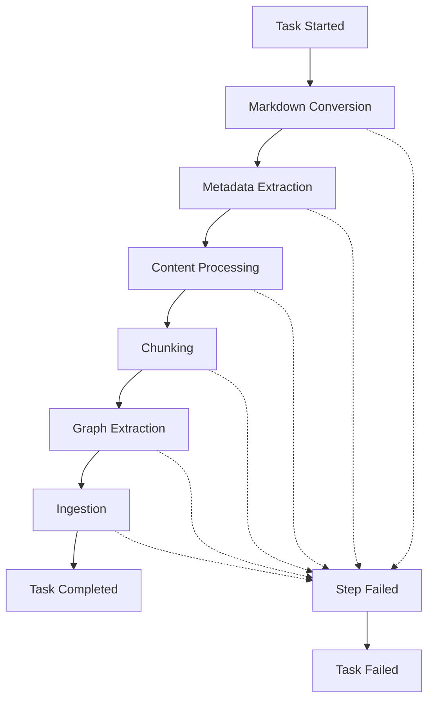

# MoRAG Webhook Integration Guide

## Table of Contents

1. [Overview](#overview)
2. [Webhook Types](#webhook-types)
3. [Quick Start](#quick-start)
4. [Webhook Schemas](#webhook-schemas)
   - [Task Lifecycle Webhooks](#task-lifecycle-webhooks)
   - [Processing Step Webhooks](#processing-step-webhooks)
5. [API Endpoints](#api-endpoints)
6. [Testing & Validation](#testing--validation)
7. [Implementation Examples](#implementation-examples)
8. [Database Integration Examples](#database-integration-examples)
9. [Error Handling & Monitoring](#error-handling--monitoring)
10. [Configuration](#configuration)
11. [Security Considerations](#security-considerations)
12. [Troubleshooting](#troubleshooting)
13. [Support](#support)

## Overview

MoRAG provides comprehensive webhook notifications for document processing lifecycle events, enabling real-time monitoring of task progress, completion, and failures. This guide covers all webhook types, their schemas, and implementation examples for consumer applications.

### Key Features
- **Real-time Processing Updates**: Get notified instantly when tasks start, progress, complete, or fail
- **Detailed Step Tracking**: Monitor individual processing steps with specific data payloads
- **Rich Metadata**: Comprehensive information for each processing stage
- **Reliable Delivery**: Automatic retry logic with exponential backoff
- **Flexible Authentication**: Optional bearer token support
- **Complete History**: 7-day event retention for debugging and monitoring

## Webhook Types

MoRAG supports two main categories of webhooks:

### 1. Task Lifecycle Webhooks
- **Task Started**: Initial task creation and processing start
- **Task Progress**: General progress updates at key milestones
- **Task Completed**: Final completion with results summary
- **Task Failed**: Error notifications with detailed failure information

### 2. Processing Step Webhooks
- **Step Started**: Individual processing step initiation
- **Step Completed**: Step completion with step-specific data
- **Step Failed**: Step-level failure notifications

### Webhook Reference Table

| Event Type | Trigger | Progress % | Key Data |
|------------|---------|------------|----------|
| `task_started` | Task begins | 0% | `task_id`, `metadata` |
| `task_progress` | Milestone reached | 25%, 50%, 75% | `progress`, `stage` |
| `task_completed` | Task finishes | 100% | `result`, `processing_time` |
| `task_failed` | Unrecoverable error | Variable | `error`, `error_details` |
| **Step Events** | **Processing Stage** | **Range** | **Specific Data** |
| `markdown_conversion` | Content conversion | 0-25% | `markdown_file_url`, `conversion_metadata` |
| `metadata_extraction` | File metadata | 25-40% | `metadata`, `file_properties` |
| `content_processing` | Content analysis | 40-70% | `summary`, `detected_topics`, `language` |
| `chunking` | Text segmentation | 70-80% | `chunks_created`, `chunking_strategy` |
| `graph_extraction` | Entity/relation extraction | 80-90% | `entities_extracted`, `relations_extracted` |
| `ingestion` | Database storage | 90-100% | `embeddings_stored`, `database_collection` |

### Processing Flow



## Quick Start

### 1. Start the Webhook Receiver (for testing)

```bash
python webhook_receiver.py
```

This starts a simple webhook receiver on `http://localhost:8001/webhook`

### 2. Submit a Task with Webhook

```bash
curl -X POST "http://localhost:8000/api/v1/ingest/file" \
  -H "Authorization: Bearer test-api-key" \
  -F "source_type=document" \
  -F "file=@your-document.pdf" \
  -F "webhook_url=http://localhost:8001/webhook"
```

### 3. Monitor Webhooks

Visit `http://localhost:8001/webhooks` to see all received webhook notifications.

## API Endpoints

### Status Tracking

#### Get Task Status
```http
GET /api/v1/status/{task_id}
Authorization: Bearer {api_key}
```

#### Get Task History
```http
GET /api/v1/status/{task_id}/history
Authorization: Bearer {api_key}
```

#### Get Recent Events
```http
GET /api/v1/status/events/recent?hours=24
Authorization: Bearer {api_key}
```

## Webhook Schemas

All webhooks follow a consistent base structure with event-specific data payloads.

### Base Webhook Schema

```typescript
interface BaseWebhook {
  event_type: string;           // Type of webhook event
  timestamp: string;            // ISO8601 timestamp
  data: WebhookData;           // Event-specific payload
}
```

### Task Lifecycle Webhooks

#### 1. Task Started
Sent when a new processing task begins.

```json
{
  "event_type": "task_started",
  "timestamp": "2024-01-01T10:00:00Z",
  "data": {
    "task_id": "task-abc-123-def",
    "status": "started",
    "message": "Task processing started",
    "metadata": {
      "source_type": "document",
      "webhook_url": "https://your-app.com/webhook",
      "document_id": "my-document-456",
      "collection_name": "documents_en",
      "language": "en"
    }
  }
}
```

#### 2. Task Progress
General progress updates at key milestones (25%, 50%, 75%).

```json
{
  "event_type": "task_progress",
  "timestamp": "2024-01-01T10:01:00Z",
  "data": {
    "task_id": "task-abc-123-def",
    "status": "progress",
    "progress": 0.5,
    "message": "Processing content...",
    "metadata": {
      "stage": "content_processing",
      "current_step": "markdown_conversion"
    }
  }
}
```

#### 3. Task Completed
Final notification when task completes successfully.

```json
{
  "event_type": "task_completed",
  "timestamp": "2024-01-01T10:05:00Z",
  "data": {
    "task_id": "task-abc-123-def",
    "status": "completed",
    "message": "Task completed successfully",
    "result": {
      "embeddings_stored": 156,
      "chunks_created": 89,
      "facts_extracted": 234,
      "processing_time_seconds": 45.2,
      "database_collection": "documents_en"
    },
    "metadata": {
      "source_type": "document",
      "document_id": "my-document-456"
    }
  }
}
```

#### 4. Task Failed
Notification when task encounters unrecoverable errors.

```json
{
  "event_type": "task_failed",
  "timestamp": "2024-01-01T10:02:00Z",
  "data": {
    "task_id": "task-abc-123-def",
    "status": "failed",
    "message": "Task failed during content processing",
    "error": "File format not supported: .xyz",
    "error_details": {
      "stage": "content_processing",
      "step": "markdown_conversion",
      "error_code": "UNSUPPORTED_FORMAT"
    },
    "metadata": {
      "source_type": "document",
      "document_id": "my-document-456"
    }
  }
}
```

### Processing Step Webhooks

These webhooks provide detailed progress for each processing stage with step-specific data.

#### Base Step Webhook Schema

```typescript
interface StepWebhook {
  task_id: string;              // Background task ID
  document_id?: string;         // Document ID if provided
  step: string;                 // Processing step name
  status: "started" | "completed" | "failed";
  progress_percent: number;     // Overall progress (0-100)
  timestamp: string;            // ISO8601 timestamp
  data?: object;               // Step-specific data
  error_message?: string;      // Error message if failed
}
```

#### 1. Markdown Conversion

**Step Started:**
```json
{
  "task_id": "task-abc-123-def",
  "document_id": "my-document-456",
  "step": "markdown_conversion",
  "status": "started",
  "progress_percent": 0.0,
  "timestamp": "2024-01-15T10:30:00Z"
}
```

**Step Completed:**
```json
{
  "task_id": "task-abc-123-def",
  "document_id": "my-document-456",
  "step": "markdown_conversion",
  "status": "completed",
  "progress_percent": 25.0,
  "timestamp": "2024-01-15T10:31:00Z",
  "data": {
    "markdown_file_url": "/api/files/temp/task-abc-123-def/markdown.md",
    "conversion_metadata": {
      "original_format": "pdf",
      "file_size_bytes": 1048576,
      "content_length": 52428,
      "page_count": 15,
      "conversion_time_seconds": 12.3
    }
  }
}
```

#### 2. Metadata Extraction

**Step Completed:**
```json
{
  "task_id": "task-abc-123-def",
  "document_id": "my-document-456",
  "step": "metadata_extraction",
  "status": "completed",
  "progress_percent": 40.0,
  "timestamp": "2024-01-15T10:32:00Z",
  "data": {
    "metadata_file_url": "/api/files/temp/task-abc-123-def/metadata.json",
    "metadata": {
      "title": "Machine Learning Fundamentals",
      "author": "Dr. Jane Smith",
      "creation_date": "2024-01-10",
      "format": "application/pdf",
      "language": "en",
      "page_count": 15,
      "file_size_bytes": 1048576
    }
  }
}
```

#### 3. Content Processing & Analysis

**Step Completed:**
```json
{
  "task_id": "task-abc-123-def",
  "document_id": "my-document-456",
  "step": "content_processing",
  "status": "completed",
  "progress_percent": 70.0,
  "timestamp": "2024-01-15T10:33:00Z",
  "data": {
    "summary": "This document covers fundamental concepts in machine learning including supervised learning, neural networks, and optimization techniques...",
    "content_length": 52428,
    "language": "en",
    "detected_topics": [
      "machine learning",
      "neural networks",
      "optimization",
      "supervised learning"
    ],
    "processing_time_seconds": 8.7
  }
}
```

#### 4. Chunking

**Step Completed:**
```json
{
  "task_id": "task-abc-123-def",
  "document_id": "my-document-456",
  "step": "chunking",
  "status": "completed",
  "progress_percent": 80.0,
  "timestamp": "2024-01-15T10:34:00Z",
  "data": {
    "chunks_created": 89,
    "chunking_strategy": "semantic",
    "average_chunk_size": 589,
    "chunk_size_range": {
      "min": 245,
      "max": 1024
    },
    "chunks_file_url": "/api/files/temp/task-abc-123-def/chunks.json"
  }
}
```

#### 5. Graph Extraction

**Step Completed:**
```json
{
  "task_id": "task-abc-123-def",
  "document_id": "my-document-456",
  "step": "graph_extraction",
  "status": "completed",
  "progress_percent": 90.0,
  "timestamp": "2024-01-15T10:35:00Z",
  "data": {
    "entities_extracted": 234,
    "relations_extracted": 156,
    "facts_extracted": 312,
    "top_entities": [
      {"name": "machine learning", "type": "Concept", "mentions": 23},
      {"name": "neural networks", "type": "Technology", "mentions": 18},
      {"name": "optimization", "type": "Process", "mentions": 15}
    ],
    "extraction_time_seconds": 15.4
  }
}
```

#### 6. Final Ingestion

**Step Completed:**
```json
{
  "task_id": "task-abc-123-def",
  "document_id": "my-document-456",
  "step": "ingestion",
  "status": "completed",
  "progress_percent": 100.0,
  "timestamp": "2024-01-15T10:36:00Z",
  "data": {
    "embeddings_stored": 156,
    "chunks_ingested": 89,
    "facts_stored": 312,
    "entities_stored": 234,
    "relations_stored": 156,
    "database_collection": "documents_en",
    "processing_time_seconds": 45.2,
    "storage_summary": {
      "qdrant_points": 156,
      "neo4j_nodes": 234,
      "neo4j_relationships": 156
    }
  }
}
```

#### Step Failed Example

```json
{
  "task_id": "task-abc-123-def",
  "document_id": "my-document-456",
  "step": "markdown_conversion",
  "status": "failed",
  "progress_percent": 10.0,
  "timestamp": "2024-01-15T10:30:30Z",
  "error_message": "Unsupported file format: .xyz files cannot be converted to markdown",
  "data": {
    "error_code": "UNSUPPORTED_FORMAT",
    "attempted_format": "xyz",
    "supported_formats": ["pdf", "docx", "txt", "md", "mp4", "mp3", "wav"]
  }
}
```

## Configuration

### Environment Variables

```bash
# Webhook settings
WEBHOOK_TIMEOUT=30          # Timeout in seconds
WEBHOOK_MAX_RETRIES=3       # Number of retry attempts
WEBHOOK_RETRY_DELAY=5       # Base delay between retries
```

### Webhook URL Requirements

- Must be a valid HTTP/HTTPS URL
- Should respond with 2xx status code for success
- Timeout: 30 seconds (configurable)
- Content-Type: application/json

## Testing & Validation

### Webhook Testing Tools

#### 1. Simple Test Server

```python
# test_webhook_server.py
from flask import Flask, request, jsonify
import json
from datetime import datetime

app = Flask(__name__)
received_webhooks = []

@app.route('/webhook', methods=['POST'])
def test_webhook():
    payload = request.json
    received_webhooks.append({
        'payload': payload,
        'received_at': datetime.now().isoformat(),
        'headers': dict(request.headers)
    })

    print(f"Received webhook: {payload.get('event_type')} for task {payload.get('data', {}).get('task_id')}")
    return jsonify({'status': 'received'})

@app.route('/webhooks', methods=['GET'])
def list_webhooks():
    return jsonify(received_webhooks)

@app.route('/webhooks/clear', methods=['POST'])
def clear_webhooks():
    received_webhooks.clear()
    return jsonify({'status': 'cleared'})

if __name__ == '__main__':
    app.run(host='0.0.0.0', port=8001, debug=True)
```

#### 2. Webhook Validator

```python
# webhook_validator.py
import json
import jsonschema
from typing import Dict, Any, List

# JSON Schema for webhook validation
WEBHOOK_SCHEMA = {
    "type": "object",
    "required": ["event_type", "timestamp", "data"],
    "properties": {
        "event_type": {"type": "string"},
        "timestamp": {"type": "string", "format": "date-time"},
        "data": {
            "type": "object",
            "required": ["task_id", "status"],
            "properties": {
                "task_id": {"type": "string"},
                "status": {"type": "string"},
                "step": {"type": "string"},
                "progress_percent": {"type": "number", "minimum": 0, "maximum": 100},
                "message": {"type": "string"},
                "error_message": {"type": "string"},
                "data": {"type": "object"},
                "result": {"type": "object"},
                "metadata": {"type": "object"}
            }
        }
    }
}

def validate_webhook(payload: Dict[str, Any]) -> List[str]:
    """Validate webhook payload against schema."""
    errors = []

    try:
        jsonschema.validate(payload, WEBHOOK_SCHEMA)
    except jsonschema.ValidationError as e:
        errors.append(f"Schema validation error: {e.message}")

    # Additional business logic validation
    data = payload.get('data', {})

    # Validate progress percentage for step webhooks
    if 'step' in data and 'progress_percent' in data:
        progress = data['progress_percent']
        if not 0 <= progress <= 100:
            errors.append(f"Invalid progress percentage: {progress}")

    # Validate event type consistency
    event_type = payload.get('event_type')
    status = data.get('status')

    if event_type == 'task_completed' and status != 'completed':
        errors.append(f"Event type '{event_type}' inconsistent with status '{status}'")

    return errors

# Usage example
def test_webhook_payload():
    test_payload = {
        "event_type": "task_completed",
        "timestamp": "2024-01-15T10:30:00Z",
        "data": {
            "task_id": "test-123",
            "status": "completed",
            "result": {"chunks_created": 25}
        }
    }

    errors = validate_webhook(test_payload)
    if errors:
        print("Validation errors:", errors)
    else:
        print("Webhook payload is valid")
```

#### 3. Integration Test Examples

```python
# test_webhook_integration.py
import pytest
import requests
import json
import time
from unittest.mock import patch, MagicMock

class TestWebhookIntegration:

    @pytest.fixture
    def webhook_server_url(self):
        return "http://localhost:8001/webhook"

    @pytest.fixture
    def mock_webhook_server(self):
        """Mock webhook server for testing."""
        received_webhooks = []

        def mock_post(url, json=None, **kwargs):
            response = MagicMock()
            response.status_code = 200
            response.json.return_value = {"status": "received"}
            received_webhooks.append(json)
            return response

        with patch('requests.post', side_effect=mock_post):
            yield received_webhooks

    def test_task_lifecycle_webhooks(self, mock_webhook_server):
        """Test complete task lifecycle webhook sequence."""
        from morag.services.enhanced_webhook_service import get_webhook_service

        webhook_service = get_webhook_service()
        webhook_url = "https://example.com/webhook"
        task_id = "test-task-123"

        # Test task started
        webhook_service.send_task_started(
            task_id=task_id,
            webhook_url=webhook_url,
            metadata={"source_type": "document"}
        )

        # Test step progress
        webhook_service.send_step_completed(
            webhook_url=webhook_url,
            task_id=task_id,
            document_id="doc-456",
            step="markdown_conversion",
            progress_percent=25.0,
            data={"conversion_metadata": {"page_count": 10}}
        )

        # Test task completion
        webhook_service.send_task_completed(
            task_id=task_id,
            webhook_url=webhook_url,
            result={"chunks_created": 25, "processing_time": 45.2}
        )

        # Verify webhook sequence
        assert len(mock_webhook_server) == 3

        # Verify task started webhook
        started_webhook = mock_webhook_server[0]
        assert started_webhook['event_type'] == 'task_started'
        assert started_webhook['data']['task_id'] == task_id

        # Verify step webhook
        step_webhook = mock_webhook_server[1]
        assert step_webhook['data']['step'] == 'markdown_conversion'
        assert step_webhook['data']['progress_percent'] == 25.0

        # Verify completion webhook
        completed_webhook = mock_webhook_server[2]
        assert completed_webhook['event_type'] == 'task_completed'
        assert completed_webhook['data']['result']['chunks_created'] == 25

    def test_webhook_retry_logic(self, mock_webhook_server):
        """Test webhook retry mechanism."""
        from morag.services.enhanced_webhook_service import EnhancedWebhookService

        # Configure service with retries
        webhook_service = EnhancedWebhookService(max_retries=2, timeout_seconds=5)

        # Mock failing then succeeding requests
        call_count = 0
        def mock_post_with_failures(url, **kwargs):
            nonlocal call_count
            call_count += 1

            response = MagicMock()
            if call_count <= 2:  # First two calls fail
                response.status_code = 500
            else:  # Third call succeeds
                response.status_code = 200
                response.json.return_value = {"status": "received"}

            return response

        with patch('requests.post', side_effect=mock_post_with_failures):
            result = webhook_service.send_task_started(
                task_id="test-retry",
                webhook_url="https://example.com/webhook"
            )

            assert result is True  # Should eventually succeed
            assert call_count == 3  # Should have made 3 attempts

### Run Integration Tests
```bash
pytest tests/integration/test_webhooks.py -v
```

### Manual Testing Commands

```bash
# Terminal 1: Start webhook test server
python test_webhook_server.py

# Terminal 2: Start MoRAG API
python -m uvicorn src.morag.main:app --reload

# Terminal 3: Test webhook with file upload
curl -X POST "http://localhost:8000/api/v1/process" \
  -H "Authorization: Bearer test-api-key" \
  -F "file=@test-document.pdf" \
  -F 'request_data={"mode":"ingest","webhook_config":{"url":"http://localhost:8001/webhook"}}'

# Terminal 4: Monitor received webhooks
curl http://localhost:8001/webhooks | jq '.'
```

## Security Considerations

### Webhook Security
- Use HTTPS URLs in production
- Implement webhook signature verification
- Validate webhook payloads
- Rate limit webhook endpoints

### API Security
- Always use API keys for authentication
- Restrict webhook URLs to trusted domains
- Monitor webhook delivery failures

## Troubleshooting

### Common Issues

#### Webhook Not Received
1. Check if webhook URL is accessible
2. Verify webhook endpoint returns 2xx status
3. Check MoRAG logs for delivery errors
4. Ensure firewall allows outbound connections

#### Task Status Not Updating
1. Verify Redis is running and accessible
2. Check Celery worker status
3. Review task logs for errors

#### History Not Available
1. Confirm Redis connection
2. Check if task ID is correct
3. Verify history retention settings

### Debug Commands

```bash
# Check webhook delivery logs
docker logs morag-api | grep webhook

# Check Redis status history
redis-cli keys "task_history:*"

# Check Celery task status
celery -A morag.core.celery_app inspect active
```

## Production Deployment

### Recommended Setup
- Use HTTPS for webhook URLs
- Implement webhook signature verification
- Set up monitoring for webhook delivery failures
- Configure appropriate retry policies
- Use Redis Cluster for high availability

### Monitoring
- Track webhook delivery success rates
- Monitor task completion times
- Alert on high failure rates
- Log webhook response times

## Examples

### n8n Integration
```javascript
// n8n webhook node configuration
{
  "httpMethod": "POST",
  "path": "morag-webhook",
  "responseMode": "responseNode",
  "options": {}
}
```

### Zapier Integration
```javascript
// Zapier webhook trigger
{
  "url": "https://hooks.zapier.com/hooks/catch/123456/abcdef/",
  "method": "POST",
  "headers": {
    "Content-Type": "application/json"
  }
}
```

## Implementation Examples

### TypeScript/JavaScript Consumer

```typescript
interface WebhookPayload {
  event_type: string;
  timestamp: string;
  data: any;
}

// Express.js webhook handler
app.post('/webhook', (req: Request, res: Response) => {
  const payload: WebhookPayload = req.body;

  switch (payload.event_type) {
    case 'task_started':
      handleTaskStarted(payload.data);
      break;
    case 'task_completed':
      handleTaskCompleted(payload.data);
      break;
    case 'task_failed':
      handleTaskFailed(payload.data);
      break;
    default:
      // Handle step webhooks
      if (payload.data.step) {
        handleStepUpdate(payload.data);
      }
  }

  res.json({ status: 'received' });
});

function handleTaskStarted(data: any) {
  console.log(`Task ${data.task_id} started`);
  // Update UI, database, etc.
}

function handleTaskCompleted(data: any) {
  console.log(`Task ${data.task_id} completed with ${data.result.chunks_created} chunks`);
  // Process final results
}

function handleStepUpdate(data: any) {
  console.log(`Step ${data.step} ${data.status} - ${data.progress_percent}%`);
  // Update progress bar, log progress, etc.
}
```

### Python Flask Consumer

```python
from flask import Flask, request, jsonify
import logging

app = Flask(__name__)
logger = logging.getLogger(__name__)

@app.route('/webhook', methods=['POST'])
def handle_webhook():
    payload = request.json
    event_type = payload.get('event_type')
    data = payload.get('data', {})

    try:
        if event_type == 'task_started':
            handle_task_started(data)
        elif event_type == 'task_completed':
            handle_task_completed(data)
        elif event_type == 'task_failed':
            handle_task_failed(data)
        elif 'step' in data:
            handle_step_update(data)

        return jsonify({'status': 'received'})

    except Exception as e:
        logger.error(f"Webhook processing error: {e}")
        return jsonify({'status': 'error', 'message': str(e)}), 500

def handle_task_started(data):
    task_id = data['task_id']
    logger.info(f"Task {task_id} started")
    # Update database, send notifications, etc.

def handle_task_completed(data):
    task_id = data['task_id']
    result = data.get('result', {})
    logger.info(f"Task {task_id} completed: {result.get('chunks_created', 0)} chunks")
    # Process final results, update UI, etc.

def handle_task_failed(data):
    task_id = data['task_id']
    error = data.get('error', 'Unknown error')
    logger.error(f"Task {task_id} failed: {error}")
    # Handle failure, notify users, etc.

def handle_step_update(data):
    task_id = data['task_id']
    step = data['step']
    status = data['status']
    progress = data['progress_percent']

    logger.info(f"Task {task_id} - {step} {status} ({progress}%)")

    if status == 'completed' and 'data' in data:
        step_data = data['data']
        # Process step-specific data
        if step == 'markdown_conversion':
            handle_markdown_conversion(step_data)
        elif step == 'ingestion':
            handle_ingestion_complete(step_data)

def handle_markdown_conversion(data):
    markdown_url = data.get('markdown_file_url')
    metadata = data.get('conversion_metadata', {})
    logger.info(f"Markdown conversion complete: {metadata.get('page_count', 0)} pages")

def handle_ingestion_complete(data):
    chunks = data.get('chunks_ingested', 0)
    facts = data.get('facts_stored', 0)
    logger.info(f"Ingestion complete: {chunks} chunks, {facts} facts")
```

### Go Consumer

```go
package main

import (
    "encoding/json"
    "fmt"
    "log"
    "net/http"
    "time"
)

type WebhookPayload struct {
    EventType string                 `json:"event_type"`
    Timestamp string                 `json:"timestamp"`
    Data      map[string]interface{} `json:"data"`
}

func webhookHandler(w http.ResponseWriter, r *http.Request) {
    var payload WebhookPayload
    if err := json.NewDecoder(r.Body).Decode(&payload); err != nil {
        http.Error(w, "Invalid JSON", http.StatusBadRequest)
        return
    }

    switch payload.EventType {
    case "task_started":
        handleTaskStarted(payload.Data)
    case "task_completed":
        handleTaskCompleted(payload.Data)
    case "task_failed":
        handleTaskFailed(payload.Data)
    default:
        if step, exists := payload.Data["step"]; exists {
            handleStepUpdate(payload.Data, step.(string))
        }
    }

    w.Header().Set("Content-Type", "application/json")
    json.NewEncoder(w).Encode(map[string]string{"status": "received"})
}

func handleTaskStarted(data map[string]interface{}) {
    taskID := data["task_id"].(string)
    log.Printf("Task %s started", taskID)
}

func handleTaskCompleted(data map[string]interface{}) {
    taskID := data["task_id"].(string)
    result := data["result"].(map[string]interface{})
    chunks := result["chunks_created"].(float64)
    log.Printf("Task %s completed with %.0f chunks", taskID, chunks)
}

func handleStepUpdate(data map[string]interface{}, step string) {
    taskID := data["task_id"].(string)
    status := data["status"].(string)
    progress := data["progress_percent"].(float64)

    log.Printf("Task %s - %s %s (%.1f%%)", taskID, step, status, progress)
}

func main() {
    http.HandleFunc("/webhook", webhookHandler)
    log.Println("Webhook server starting on :8080")
    log.Fatal(http.ListenAndServe(":8080", nil))
}
```

### Webhook Security & Validation

```python
import hmac
import hashlib
from flask import request, abort

def validate_webhook_signature(payload, signature, secret):
    """Validate webhook signature for security."""
    expected_signature = hmac.new(
        secret.encode('utf-8'),
        payload,
        hashlib.sha256
    ).hexdigest()

    return hmac.compare_digest(f"sha256={expected_signature}", signature)

@app.route('/webhook', methods=['POST'])
def secure_webhook():
    # Validate signature if provided
    signature = request.headers.get('X-MoRAG-Signature')
    if signature and WEBHOOK_SECRET:
        if not validate_webhook_signature(request.data, signature, WEBHOOK_SECRET):
            abort(401)

    # Process webhook...
    return jsonify({'status': 'received'})
```

## Database Integration Examples

### Storing Webhook Events

```python
from sqlalchemy import create_engine, Column, String, DateTime, Text, Float
from sqlalchemy.ext.declarative import declarative_base
from sqlalchemy.orm import sessionmaker
from datetime import datetime

Base = declarative_base()

class WebhookEvent(Base):
    __tablename__ = 'webhook_events'

    id = Column(String, primary_key=True)
    task_id = Column(String, nullable=False, index=True)
    event_type = Column(String, nullable=False)
    step = Column(String, nullable=True)
    status = Column(String, nullable=False)
    progress_percent = Column(Float, nullable=True)
    timestamp = Column(DateTime, nullable=False)
    data = Column(Text, nullable=True)  # JSON data
    error_message = Column(Text, nullable=True)

def store_webhook_event(payload):
    """Store webhook event in database."""
    event = WebhookEvent(
        id=f"{payload['data']['task_id']}_{int(time.time())}",
        task_id=payload['data']['task_id'],
        event_type=payload['event_type'],
        step=payload['data'].get('step'),
        status=payload['data']['status'],
        progress_percent=payload['data'].get('progress_percent'),
        timestamp=datetime.fromisoformat(payload['timestamp'].replace('Z', '+00:00')),
        data=json.dumps(payload['data'].get('data')),
        error_message=payload['data'].get('error_message')
    )

    session.add(event)
    session.commit()
```

### Real-time Updates with WebSockets

```javascript
// Client-side WebSocket for real-time updates
const socket = io();

// Handle webhook data forwarded via WebSocket
socket.on('task_update', (data) => {
    updateProgressBar(data.progress_percent);
    updateStatusMessage(data.message);

    if (data.event_type === 'task_completed') {
        showCompletionNotification(data.result);
    }
});

function updateProgressBar(percent) {
    document.getElementById('progress').style.width = `${percent}%`;
    document.getElementById('progress-text').textContent = `${percent.toFixed(1)}%`;
}

// Server-side WebSocket forwarding
app.post('/webhook', (req, res) => {
    const payload = req.body;

    // Store in database
    storeWebhookEvent(payload);

    // Forward to connected clients via WebSocket
    io.emit('task_update', payload);

    res.json({ status: 'received' });
});
```

## Error Handling & Monitoring

### Comprehensive Error Handling

```python
import logging
from datetime import datetime
from typing import Dict, Any

logger = logging.getLogger(__name__)

class WebhookProcessor:
    def __init__(self):
        self.failed_webhooks = []
        self.processing_stats = {
            'total_received': 0,
            'successful': 0,
            'failed': 0,
            'last_error': None
        }

    def process_webhook(self, payload: Dict[str, Any]) -> bool:
        """Process webhook with comprehensive error handling."""
        self.processing_stats['total_received'] += 1

        try:
            # Validate payload structure
            self._validate_payload(payload)

            # Process based on event type
            event_type = payload.get('event_type')
            data = payload.get('data', {})

            if event_type == 'task_started':
                self._handle_task_started(data)
            elif event_type == 'task_completed':
                self._handle_task_completed(data)
            elif event_type == 'task_failed':
                self._handle_task_failed(data)
            elif 'step' in data:
                self._handle_step_update(data)
            else:
                raise ValueError(f"Unknown event type: {event_type}")

            self.processing_stats['successful'] += 1
            logger.info(f"Successfully processed webhook: {event_type}")
            return True

        except Exception as e:
            self.processing_stats['failed'] += 1
            self.processing_stats['last_error'] = str(e)

            # Store failed webhook for retry
            self.failed_webhooks.append({
                'payload': payload,
                'error': str(e),
                'timestamp': datetime.now().isoformat(),
                'retry_count': 0
            })

            logger.error(f"Webhook processing failed: {e}", exc_info=True)
            return False

    def _validate_payload(self, payload: Dict[str, Any]):
        """Validate webhook payload structure."""
        required_fields = ['event_type', 'timestamp', 'data']
        for field in required_fields:
            if field not in payload:
                raise ValueError(f"Missing required field: {field}")

        # Validate timestamp format
        try:
            datetime.fromisoformat(payload['timestamp'].replace('Z', '+00:00'))
        except ValueError:
            raise ValueError("Invalid timestamp format")

    def retry_failed_webhooks(self, max_retries: int = 3):
        """Retry processing failed webhooks."""
        for failed_webhook in self.failed_webhooks[:]:
            if failed_webhook['retry_count'] < max_retries:
                failed_webhook['retry_count'] += 1
                if self.process_webhook(failed_webhook['payload']):
                    self.failed_webhooks.remove(failed_webhook)
```

## Webhook Event Summary

### Complete Event Sequence Example

For a typical document processing task, you can expect the following webhook sequence:

```
1. task_started (0%)
2. markdown_conversion started (0%)
3. markdown_conversion completed (25%)
4. metadata_extraction started (25%)
5. metadata_extraction completed (40%)
6. content_processing started (40%)
7. content_processing completed (70%)
8. chunking started (70%)
9. chunking completed (80%)
10. graph_extraction started (80%)
11. graph_extraction completed (90%)
12. ingestion started (90%)
13. ingestion completed (100%)
14. task_completed (100%)
```

### Best Practices for Consumers

1. **Idempotency**: Handle duplicate webhooks gracefully
2. **Validation**: Always validate webhook payloads
3. **Error Handling**: Implement comprehensive error handling
4. **Monitoring**: Track webhook delivery success rates
5. **Security**: Use HTTPS and validate signatures in production
6. **Performance**: Process webhooks asynchronously
7. **Logging**: Log all webhook events for debugging
8. **Retry Logic**: Implement client-side retry for critical operations

### Common Integration Patterns

- **Progress Tracking**: Update UI progress bars based on `progress_percent`
- **Status Dashboard**: Display current processing stage and step
- **Notification System**: Send alerts on completion or failure
- **Data Pipeline**: Trigger downstream processes on completion
- **Analytics**: Track processing times and success rates
- **Debugging**: Store webhook history for troubleshooting

## Support

For issues or questions:
1. Check the troubleshooting section
2. Review the integration tests
3. Check MoRAG logs for detailed error messages
4. Create an issue with reproduction steps
5. Review webhook payload validation
6. Check webhook endpoint accessibility and response codes
7. Test with the provided webhook validation tools
8. Verify webhook URL is accessible from MoRAG server

### Additional Resources

- [API Usage Guide](API_USAGE_GUIDE.md) - Complete API documentation
- [Integration Tests](tests/integration/test_webhooks.py) - Example test implementations
- [Webhook Receiver Example](webhook_receiver.py) - Simple webhook server for testing
