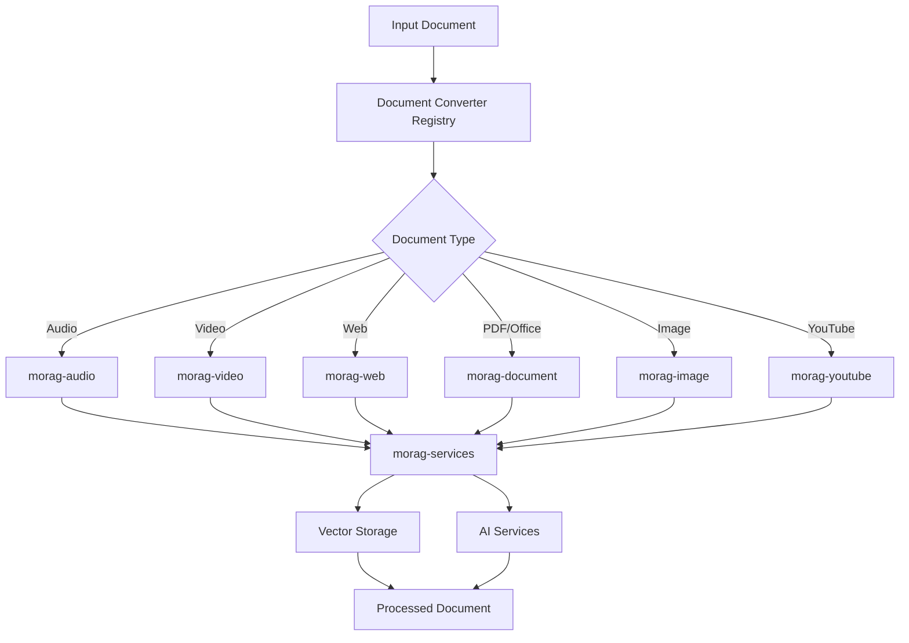
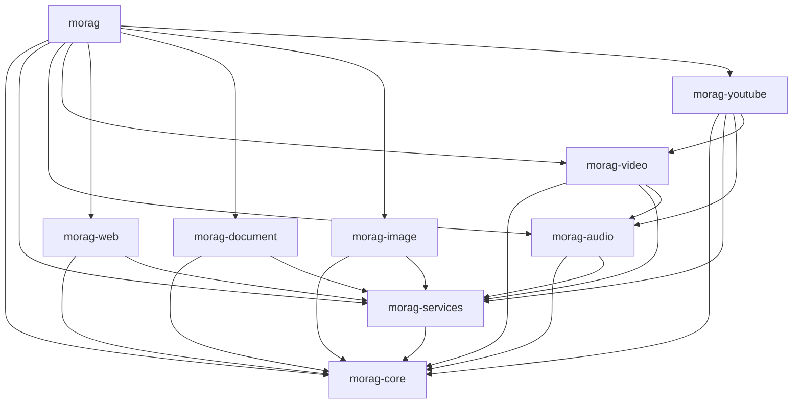

# MoRAG Architecture Documentation

## Overview

MoRAG (Modular Retrieval-Augmented Generation) is a modular document processing and AI system designed for scalability, maintainability, and extensibility. The system has been migrated from a monolithic architecture to a modular package-based architecture.

## Architecture Principles

### 1. Modular Design
- **Separation of Concerns**: Each package handles a specific domain (audio, video, web, etc.)
- **Loose Coupling**: Packages interact through well-defined interfaces
- **High Cohesion**: Related functionality is grouped within packages

### 2. Dependency Management
- **Hierarchical Dependencies**: Clear dependency hierarchy prevents circular dependencies
- **Interface-Based Design**: Packages depend on interfaces, not implementations
- **Optional Dependencies**: Packages can function independently when possible

### 3. Scalability
- **Horizontal Scaling**: Individual packages can be scaled independently
- **Service Isolation**: Each package can be deployed as a separate service
- **Resource Optimization**: Only required packages need to be loaded

## Package Architecture

### Core Package (`morag-core`)

**Purpose**: Provides foundational interfaces, models, and utilities used by all other packages.

**Key Components**:
- `interfaces/` - Base classes and protocols
  - `BaseProcessor` - Interface for all processors
  - `BaseConverter` - Interface for all converters
  - `BaseService` - Interface for all services
- `models/` - Core data models
  - `Document` - Primary document model
  - `DocumentChunk` - Document chunk model
  - `ConversionOptions` - Configuration model
- `config/` - Configuration management
- `exceptions/` - Custom exception classes
- `utils/` - Shared utility functions

**Dependencies**: None (base package)

### Services Package (`morag-services`)

**Purpose**: Provides AI services, vector storage, and processing orchestration.

**Key Components**:
- `embedding/` - Text embedding services (Gemini, OpenAI)
- `storage/` - Vector database services (Qdrant)
- `processing/` - Document processing services
- `celery_app/` - Task queue management
- `metrics/` - Performance monitoring

**Dependencies**: `morag-core`

### Domain-Specific Packages

#### Audio Package (`morag-audio`)
- **Purpose**: Audio processing, transcription, and analysis
- **Key Features**: Whisper integration, speaker diarization, topic segmentation
- **Dependencies**: `morag-core`, `morag-services`

#### Video Package (`morag-video`)
- **Purpose**: Video processing and conversion
- **Key Features**: FFmpeg integration, frame extraction, audio extraction
- **Dependencies**: `morag-core`, `morag-services`, `morag-audio`

#### Web Package (`morag-web`)
- **Purpose**: Web content scraping and processing
- **Key Features**: HTML parsing, content extraction, URL handling
- **Dependencies**: `morag-core`, `morag-services`

#### Document Package (`morag-document`)
- **Purpose**: Document processing (PDF, Office, text)
- **Key Features**: PDF parsing, Office document conversion, text extraction
- **Dependencies**: `morag-core`, `morag-services`

#### Image Package (`morag-image`)
- **Purpose**: Image processing and OCR
- **Key Features**: OCR, image analysis, visual content extraction
- **Dependencies**: `morag-core`, `morag-services`

#### YouTube Package (`morag-youtube`)
- **Purpose**: YouTube video processing
- **Key Features**: Video download, metadata extraction, content processing
- **Dependencies**: `morag-core`, `morag-services`, `morag-audio`, `morag-video`

### Integration Package (`morag`)

**Purpose**: Main integration package that provides unified access to all functionality.

**Key Components**:
- Unified API endpoints
- Cross-package orchestration
- Configuration management
- Main application entry points

**Dependencies**: All other packages

## Data Flow Architecture



## Interface Design

### BaseProcessor Interface

```python
from abc import ABC, abstractmethod
from typing import Any, Optional
from morag_core.models import Document

class BaseProcessor(ABC):
    @abstractmethod
    async def process(self, input_data: Any, options: Optional[dict] = None) -> Document:
        """Process input data and return a Document."""
        pass

    @abstractmethod
    def supports(self, input_type: str) -> bool:
        """Check if processor supports the input type."""
        pass
```

### BaseConverter Interface

```python
from abc import ABC, abstractmethod
from pathlib import Path
from morag_core.models import ConversionResult, ConversionOptions

class BaseConverter(ABC):
    @abstractmethod
    async def convert(self, file_path: Path, options: ConversionOptions) -> ConversionResult:
        """Convert file to markdown format."""
        pass

    @abstractmethod
    def get_supported_formats(self) -> list[str]:
        """Get list of supported file formats."""
        pass
```

## Dependency Graph



## Service Communication

### Synchronous Communication
- Direct function calls within the same process
- Interface-based communication between packages
- Configuration injection for service discovery

### Asynchronous Communication
- Celery task queue for long-running operations
- Event-driven processing for real-time updates
- Message passing for cross-service communication

### Error Handling
- Centralized exception hierarchy in `morag-core`
- Circuit breaker patterns for external services
- Graceful degradation for optional services

## Configuration Management

### Hierarchical Configuration
1. **Package-level**: Each package has its own configuration
2. **Service-level**: Services can override package defaults
3. **Application-level**: Global configuration in main package
4. **Environment-level**: Environment variables override all

### Configuration Sources
- Environment variables
- Configuration files (YAML, JSON)
- Command-line arguments
- Default values in code

## Security Architecture

### Package Isolation
- Each package has minimal required permissions
- Sensitive operations isolated to specific packages
- API keys and secrets managed centrally

### Data Protection
- Input validation at package boundaries
- Sanitization of user-provided data
- Secure handling of temporary files

### Access Control
- Role-based access to different packages
- API authentication and authorization
- Audit logging for sensitive operations

## Performance Architecture

### Caching Strategy
- Multi-level caching (memory, disk, distributed)
- Package-specific cache policies
- Cache invalidation strategies

### Resource Management
- Memory-efficient processing for large files
- Streaming processing where possible
- Resource pooling for expensive operations

### Monitoring
- Package-level performance metrics
- Cross-package tracing
- Resource utilization monitoring

## Deployment Architecture

### Development Deployment
- All packages installed in development mode
- Local services (Redis, Qdrant)
- Hot reloading for development

### Production Deployment Options

#### Monolithic Deployment
- All packages in single container/process
- Simplified deployment and management
- Suitable for smaller workloads

#### Microservices Deployment
- Each package as separate service
- Independent scaling and deployment
- Container orchestration (Kubernetes)

#### Hybrid Deployment
- Core packages together
- Resource-intensive packages separate
- Balanced complexity and performance

## Migration Strategy

### From Monolithic to Modular

1. **Phase 1**: Package Creation
   - Create modular packages
   - Maintain backward compatibility
   - Gradual migration of functionality

2. **Phase 2**: Import Migration
   - Update import statements
   - Remove duplicate code
   - Validate architecture compliance

3. **Phase 3**: Service Isolation
   - Deploy packages independently
   - Implement service communication
   - Monitor and optimize

### Backward Compatibility
- Compatibility layers for legacy imports
- Gradual deprecation of old interfaces
- Migration tools and documentation

## Quality Assurance

### Testing Strategy
- Unit tests for individual packages
- Integration tests for package interactions
- End-to-end tests for complete workflows
- Performance tests for scalability

### Architecture Validation
- Automated dependency checking
- Import pattern validation
- Interface compliance testing
- Documentation synchronization

### Continuous Integration
- Package-level CI/CD pipelines
- Cross-package integration testing
- Automated architecture validation
- Performance regression testing

## Future Considerations

### Extensibility
- Plugin architecture for new document types
- Custom processor registration
- Third-party package integration

### Scalability
- Horizontal scaling of individual packages
- Load balancing strategies
- Distributed processing capabilities

### Maintainability
- Automated dependency updates
- Package versioning strategies
- Breaking change management

This architecture provides a solid foundation for the MoRAG system's continued growth and evolution while maintaining high standards of modularity, scalability, and maintainability.
