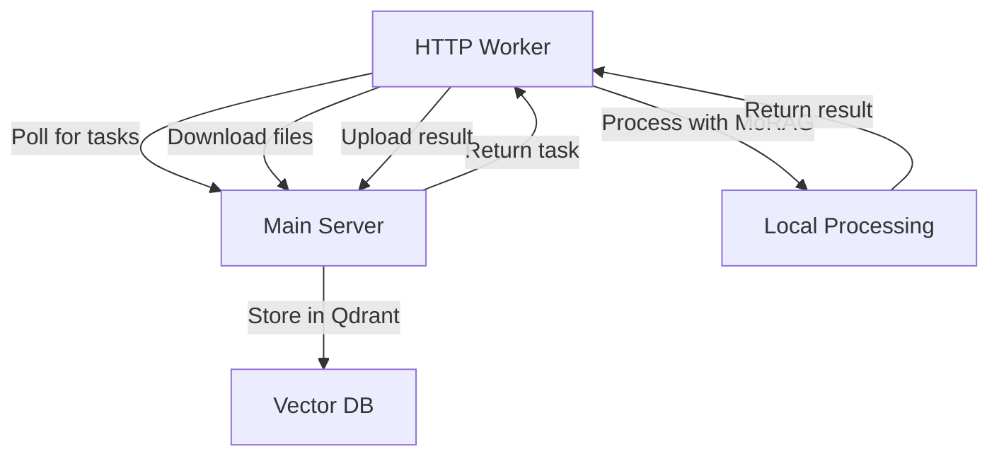

# HTTP Remote Workers - No Redis Required

This document explains how to set up and use HTTP-based remote workers for MoRAG that connect directly to the main server via HTTP API calls, eliminating the need for Redis infrastructure.

## Overview

### Why HTTP Workers?

The traditional MoRAG remote worker setup uses Redis/Celery for task distribution, which adds infrastructure complexity. HTTP workers provide a simpler alternative:

**Benefits:**
- ✅ **No Redis dependency** - Workers connect directly via HTTP
- ✅ **Simpler deployment** - Just run a Python script or Docker container
- ✅ **Better isolation** - Each worker is independent
- ✅ **Easier debugging** - Direct HTTP communication is easier to troubleshoot
- ✅ **Flexible scaling** - Add/remove workers without Redis configuration

**Trade-offs:**
- ⚠️ **Polling-based** - Workers poll for tasks instead of push notifications
- ⚠️ **Slightly higher latency** - Small delay due to polling interval
- ⚠️ **No built-in retry** - Simpler retry logic compared to Celery

## Quick Start

### 1. Python Script (Simplest)

```bash
# Start a GPU worker
python scripts/start_http_remote_worker.py \
    --server-url http://your-main-server:8000 \
    --api-key your-api-key \
    --worker-type gpu

# Start a CPU worker
python scripts/start_http_remote_worker.py \
    --server-url http://your-main-server:8000 \
    --api-key your-api-key \
    --worker-type cpu \
    --poll-interval 10 \
    --max-concurrent 2
```

### 2. Using Scripts

**Linux/macOS:**
```bash
# Configure environment
cp configs/http-worker.env.example .env
# Edit .env with your settings

# Start worker
./scripts/start-http-worker.sh
```

**Windows:**
```cmd
REM Configure environment
copy configs\http-worker.env.example .env
REM Edit .env with your settings

REM Start worker
scripts\start-http-worker.bat
```

### 3. Docker (Recommended for Production)

```bash
# Configure environment
cp configs/http-worker.env.example .env
# Edit .env with your settings

# Start GPU worker
docker-compose -f docker-compose.workers.yml up morag-http-worker-gpu

# Start CPU worker
docker-compose -f docker-compose.workers.yml up morag-http-worker-cpu

# Start both workers
docker-compose -f docker-compose.workers.yml up
```

## Configuration

### Environment Variables

Create a `.env` file or set these environment variables:

```bash
# Required
MORAG_SERVER_URL=http://your-main-server:8000
MORAG_API_KEY=your-api-key-here

# Worker Configuration
WORKER_TYPE=gpu                    # gpu or cpu
POLL_INTERVAL=5                    # seconds between task checks
MAX_CONCURRENT_TASKS=1             # max parallel tasks

# Performance
MORAG_FORCE_CPU=false             # force CPU processing
CUDA_VISIBLE_DEVICES=0            # GPU device ID
OMP_NUM_THREADS=4                 # CPU threads
```

### API Key Setup

1. **Generate API Key** on your main server:
   ```bash
   # On main server
   python -c "
   from morag.services.auth_service import APIKeyService
   import redis
   import asyncio
   
   async def create_key():
       redis_client = redis.from_url('redis://localhost:6379/0')
       service = APIKeyService(redis_client)
       key = await service.create_api_key('your-user-id', 'HTTP Worker')
       print(f'API Key: {key}')
   
   asyncio.run(create_key())
   "
   ```

2. **Use the generated key** in your worker configuration.

## Architecture

### How It Works



### Communication Flow

1. **Registration**: Worker registers with server on startup
2. **Polling**: Worker polls server for available tasks
3. **Task Assignment**: Server assigns tasks based on user/worker matching
4. **File Transfer**: Worker downloads input files via HTTP
5. **Processing**: Worker processes files using local MoRAG API
6. **Result Upload**: Worker uploads results back to server
7. **Storage**: Server stores results in vector database

### Task Types Supported

- **Audio Processing**: Transcription, speaker diarization
- **Video Processing**: Audio extraction, transcription
- **Document Processing**: PDF, Word, text conversion
- **Image Processing**: OCR, description generation
- **Web Scraping**: Page content extraction
- **YouTube Processing**: Video download and transcription

## Deployment Options

### 1. Single Worker (Development)

```bash
python scripts/start_http_remote_worker.py \
    --server-url http://localhost:8000 \
    --api-key your-key
```

### 2. Multiple Workers (Production)

```yaml
# docker-compose.workers.yml
services:
  worker-gpu-1:
    # GPU worker configuration
  worker-gpu-2:
    # Another GPU worker
  worker-cpu-1:
    # CPU fallback worker
```

### 3. Kubernetes Deployment

```yaml
apiVersion: apps/v1
kind: Deployment
metadata:
  name: morag-http-worker
spec:
  replicas: 3
  selector:
    matchLabels:
      app: morag-http-worker
  template:
    metadata:
      labels:
        app: morag-http-worker
    spec:
      containers:
      - name: worker
        image: morag-http-worker:latest
        env:
        - name: MORAG_SERVER_URL
          value: "http://morag-server:8000"
        - name: MORAG_API_KEY
          valueFrom:
            secretKeyRef:
              name: morag-secrets
              key: api-key
```

## Performance Tuning

### GPU Workers

```bash
# Optimize for GPU processing
WORKER_TYPE=gpu
MAX_CONCURRENT_TASKS=2
POLL_INTERVAL=3
MORAG_FORCE_CPU=false
CUDA_VISIBLE_DEVICES=0
OMP_NUM_THREADS=8
```

### CPU Workers

```bash
# Optimize for CPU processing
WORKER_TYPE=cpu
MAX_CONCURRENT_TASKS=1
POLL_INTERVAL=10
MORAG_FORCE_CPU=true
OMP_NUM_THREADS=4
PYTORCH_DISABLE_NNPACK=1
```

### Memory Management

```bash
# Docker memory limits
MEMORY_LIMIT=8g
MEMORY_RESERVATION=4g

# Model cache optimization
HF_HOME=/cache/huggingface
TRANSFORMERS_CACHE=/cache/huggingface
```

## Monitoring

### Health Checks

Workers expose a health check endpoint:

```bash
curl http://worker:8080/health
```

### Logging

Workers log to stdout/stderr with structured logging:

```json
{
  "timestamp": "2025-01-27T10:00:00Z",
  "level": "INFO",
  "message": "Processing task",
  "task_id": "task-123",
  "task_type": "process_audio",
  "worker_id": "worker-1"
}
```

### Metrics

Monitor these metrics:
- Task processing time
- Success/failure rates
- Queue lengths
- Worker availability
- Resource utilization

## Troubleshooting

### Common Issues

**Worker can't connect to server:**
```bash
# Check network connectivity
curl -v http://your-server:8000/health

# Check API key
curl -H "Authorization: Bearer your-key" http://your-server:8000/api/v1/workers/test
```

**Authentication failed:**
```bash
# Verify API key is correct
# Check if key has expired
# Ensure user ID matches
```

**Out of memory:**
```bash
# Reduce concurrent tasks
MAX_CONCURRENT_TASKS=1

# Increase memory limits
docker run --memory=8g ...
```

**Slow processing:**
```bash
# Use GPU worker
WORKER_TYPE=gpu

# Increase CPU threads
OMP_NUM_THREADS=8

# Reduce polling interval
POLL_INTERVAL=3
```

### Debug Mode

Enable debug logging:

```bash
LOG_LEVEL=DEBUG python scripts/start_http_remote_worker.py ...
```

## Deployment Architecture

HTTP workers use a simple polling-based architecture:

1. **Worker Registration**: Workers register with the main server on startup
2. **Task Polling**: Workers poll the server for available tasks at regular intervals
3. **Direct Processing**: Workers process tasks locally using MoRAG API
4. **Result Submission**: Workers submit results back to the server via HTTP

## Security Considerations

1. **API Key Security**: Store keys securely, rotate regularly
2. **Network Security**: Use HTTPS in production
3. **Access Control**: Limit worker access to specific users/tasks
4. **Monitoring**: Log all worker activities
5. **Isolation**: Run workers in containers or VMs

## Future Enhancements

- **WebSocket support** for real-time task assignment
- **Built-in load balancing** across multiple workers
- **Advanced retry logic** with exponential backoff
- **Worker pools** for different task types
- **Automatic scaling** based on queue length
