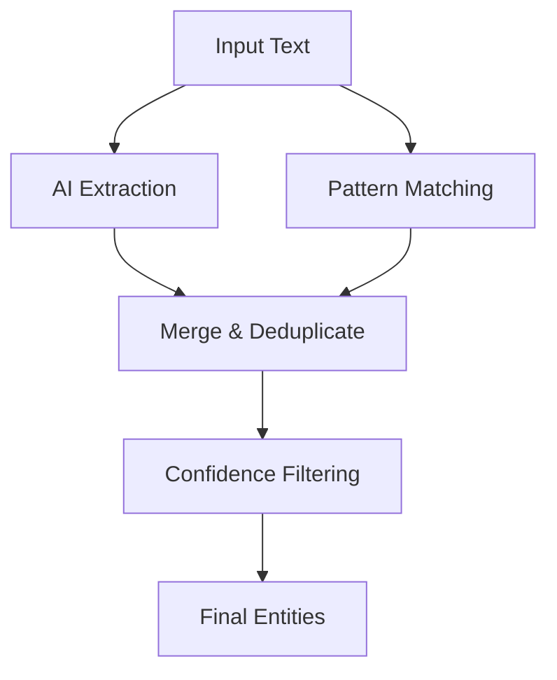

# Hybrid Entity Extraction

## Overview

MoRAG's hybrid entity extraction combines AI-powered extraction with pattern matching to achieve superior accuracy and coverage. This approach leverages the strengths of both methods:

- **AI-based extraction**: Understands context and can identify complex entities
- **Pattern matching**: Provides high precision for well-defined entity types

## Architecture

### Components

1. **EntityExtractionAgent**: PydanticAI-based agent for contextual entity extraction
2. **EntityPatternMatcher**: Rule-based pattern matcher with curated knowledge bases
3. **HybridEntityExtractor**: Orchestrates both methods and merges results

### Extraction Flow



## Usage

### Basic Hybrid Extraction

```python
from morag_graph.extraction import HybridEntityExtractor

# Create hybrid extractor
extractor = HybridEntityExtractor(
    min_confidence=0.6,
    enable_pattern_matching=True,
    pattern_confidence_boost=0.1
)

# Extract entities
text = "I'm using Python and React to build applications for Microsoft."
entities = await extractor.extract(text)

for entity in entities:
    print(f"{entity.name} ({entity.type}): {entity.confidence:.2f}")
    print(f"  Method: {entity.attributes.get('extraction_method')}")
```

### Pattern-Only Extraction

```python
from morag_graph.extraction import EntityPatternMatcher

# Use only pattern matching
matcher = EntityPatternMatcher()
entities = matcher.extract_entities(text, min_confidence=0.8)
```

### Custom Patterns

```python
from morag_graph.extraction import EntityPattern, PatternType

# Add custom patterns
custom_pattern = EntityPattern(
    pattern=r"\b(?:TensorFlow|PyTorch|Keras|Scikit-learn)\b",
    entity_type="ML_FRAMEWORK",
    pattern_type=PatternType.REGEX,
    confidence=0.9,
    description="Machine learning frameworks"
)

matcher = EntityPatternMatcher()
matcher.add_pattern(custom_pattern)
```

## Built-in Patterns

### Technology Patterns

- **Programming Languages**: Python, Java, JavaScript, TypeScript, C++, C#, Go, Rust, etc.
- **Web Frameworks**: React, Vue, Angular, Django, Flask, Spring, Express, etc.
- **Cloud & DevOps**: AWS, Azure, GCP, Docker, Kubernetes, Jenkins, GitHub, etc.
- **Databases**: PostgreSQL, MySQL, MongoDB, Redis, Elasticsearch, etc.

### Organization Patterns

- **Tech Companies**: Microsoft, Google, Apple, Amazon, Meta, Netflix, Tesla, etc.
- **Company Suffixes**: Inc, Corp, Corporation, LLC, Ltd, Limited, Company, Co

### Location Patterns

- **US Cities**: Comprehensive list of major US cities
- **International**: Can be extended with additional location patterns

### Date Patterns

- **Full Dates**: January 15, 2024
- **Numeric Dates**: 01/15/2024, 2024-01-15
- **Relative Dates**: Can be extended for relative date expressions

### Money Patterns

- **Currency Amounts**: $1,500.00, $1.5M
- **Written Amounts**: 2.5 billion dollars, five million dollars

### Product Patterns

- **Software**: iPhone, iPad, Windows, Office, Photoshop, etc.
- **Hardware**: MacBook, iMac, Apple Watch, AirPods, etc.

## Configuration

### HybridEntityExtractor Parameters

```python
extractor = HybridEntityExtractor(
    min_confidence=0.6,              # Final confidence threshold
    chunk_size=4000,                 # Max characters per chunk
    enable_pattern_matching=True,    # Enable pattern matching
    pattern_confidence_boost=0.1,    # Boost for pattern matches
    ai_confidence_boost=0.0,         # Boost for AI matches
)
```

### Pattern Matching Parameters

```python
matcher = EntityPatternMatcher()
entities = matcher.extract_entities(
    text=text,
    min_confidence=0.6  # Minimum confidence for patterns
)
```

## Merging Strategy

### Deduplication

When multiple extraction methods find the same entity:

1. **Exact Matches**: Entities with identical normalized names and types are merged
2. **Confidence Calculation**: Higher confidence entity is used as base
3. **Method Agreement Boost**: Entities found by multiple methods get confidence boost
4. **Attribute Preservation**: All extraction metadata is preserved

### Confidence Boosting

- **Pattern Matches**: Get configurable confidence boost (default: +0.1)
- **AI Matches**: Get configurable confidence boost (default: 0.0)
- **Multi-Method Agreement**: Additional +0.2 boost when multiple methods agree
- **Same Method Repetition**: Small +0.05 boost for repeated detection

## Performance Characteristics

### Accuracy Improvements

- **Precision**: Pattern matching provides high precision for known entity types
- **Recall**: AI extraction captures entities not covered by patterns
- **Coverage**: Hybrid approach covers both structured and unstructured entity types

### Speed Considerations

- **Pattern Matching**: Very fast, O(n) with text length
- **AI Extraction**: Slower, depends on model and text length
- **Parallel Processing**: Both methods can run concurrently

## Best Practices

### When to Use Hybrid Extraction

- **High Accuracy Requirements**: When precision is critical
- **Mixed Content**: Text with both structured and unstructured entities
- **Domain-Specific**: When you have known entity patterns for your domain

### When to Use AI-Only

- **Novel Domains**: When entity patterns are unknown
- **Contextual Entities**: When context is crucial for identification
- **Rapid Prototyping**: When you need quick results without pattern development

### When to Use Pattern-Only

- **High-Speed Requirements**: When processing speed is critical
- **Well-Defined Domains**: When entity types are well-known and structured
- **Offline Processing**: When AI services are not available

## Extending the System

### Adding New Patterns

```python
# Create new pattern
new_pattern = EntityPattern(
    pattern=r"\b(?:Bitcoin|Ethereum|Dogecoin|Litecoin)\b",
    entity_type="CRYPTOCURRENCY",
    pattern_type=PatternType.REGEX,
    confidence=0.9,
    description="Cryptocurrency names"
)

# Add to matcher
matcher.add_pattern(new_pattern)
```

### Custom Entity Types

```python
# Define custom entity types in your application
CUSTOM_ENTITY_TYPES = {
    "ML_FRAMEWORK": "Machine Learning Framework",
    "CRYPTOCURRENCY": "Cryptocurrency",
    "MEDICAL_DEVICE": "Medical Device",
    "LEGAL_DOCUMENT": "Legal Document Type"
}
```

### Integration with Existing Systems

```python
# Replace existing EntityExtractor with HybridEntityExtractor
# Old code:
# extractor = EntityExtractor()

# New code:
extractor = HybridEntityExtractor(
    min_confidence=0.6,
    enable_pattern_matching=True
)

# API remains the same
entities = await extractor.extract(text, source_doc_id=doc_id)
```

## Monitoring and Debugging

### Extraction Statistics

```python
stats = extractor.get_extraction_stats()
print(f"AI Agent Available: {stats['ai_agent_available']}")
print(f"Pattern Count: {stats['pattern_count']}")
print(f"Min Confidence: {stats['min_confidence']}")
```

### Entity Metadata

Each extracted entity includes detailed metadata:

```python
for entity in entities:
    attrs = entity.attributes
    print(f"Method: {attrs.get('extraction_method')}")
    print(f"Original Confidence: {attrs.get('original_confidence')}")
    print(f"Confidence Boost: {attrs.get('confidence_boost')}")
    print(f"Merged From: {attrs.get('merged_from_methods', [])}")
```

## Troubleshooting

### Common Issues

1. **Low Confidence Scores**: Adjust `min_confidence` threshold
2. **Missing Entities**: Check if patterns exist for entity types
3. **Duplicate Entities**: Verify deduplication logic is working
4. **Performance Issues**: Consider disabling pattern matching for speed

### Debug Mode

```python
import structlog
structlog.configure(level="DEBUG")

# Enable detailed logging
extractor = HybridEntityExtractor(min_confidence=0.6)
entities = await extractor.extract(text)
```
