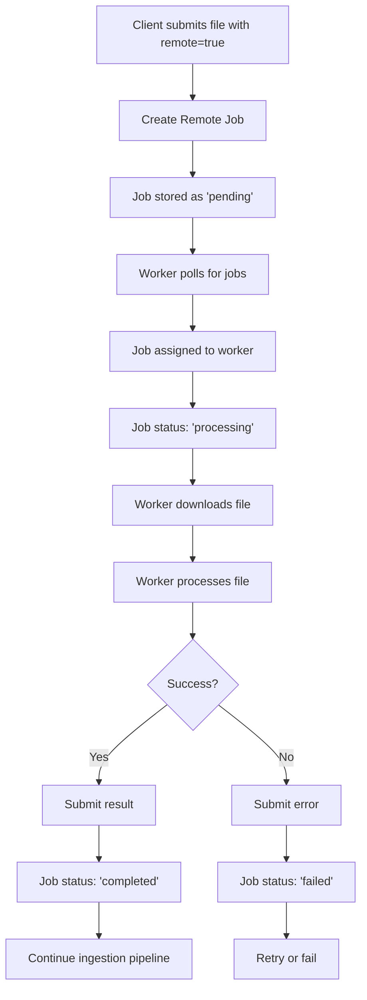

# Remote Conversion System

The Remote Conversion System allows MoRAG to offload computationally intensive tasks (audio and video processing) to remote workers, enabling horizontal scaling and GPU utilization on separate machines.

## Architecture

### Components

1. **Remote Job Model** (`RemoteJob`) - Core data model for tracking remote jobs
2. **Remote Job Repository** - File-based storage for job persistence
3. **Remote Job Service** - Business logic layer for job management
4. **API Endpoints** - REST API for job creation, polling, and result submission
5. **Integration Layer** - Seamless integration with existing ingestion pipeline

### Job Lifecycle



## API Endpoints

### Create Remote Job
```http
POST /api/v1/remote-jobs/
Content-Type: application/json

{
  "source_file_path": "/tmp/audio.mp3",
  "content_type": "audio",
  "task_options": {
    "webhook_url": "http://example.com/webhook"
  },
  "ingestion_task_id": "task-123"
}
```

### Poll for Jobs (Worker)
```http
GET /api/v1/remote-jobs/poll?worker_id=worker-1&content_types=audio,video&max_jobs=1
```

### Submit Result
```http
PUT /api/v1/remote-jobs/{job_id}/result
Content-Type: application/json

{
  "success": true,
  "content": "Processed transcript...",
  "metadata": {
    "duration": 120.5,
    "speakers": ["Speaker_00", "Speaker_01"]
  },
  "processing_time": 45.2
}
```

### Get Job Status
```http
GET /api/v1/remote-jobs/{job_id}/status
```

### Download Source File
```http
GET /api/v1/remote-jobs/{job_id}/download
```

## Usage

### Client Side (Ingestion with Remote Processing)

```python
# Upload file with remote processing enabled
import requests
import json

files = {'file': open('audio.mp3', 'rb')}
data = {
    'request_data': json.dumps({
        'mode': 'ingest',
        'source_type': 'file',
        'content_type': 'audio',
        'webhook_config': {
            'url': 'http://my-app.com/webhook'
        },
        'metadata': {
            'remote': True  # Enable remote processing
        }
    })
}

response = requests.post('http://morag-server/api/v1/process',
                        files=files, data=data)
```

### Worker Side (Remote Processing)

```python
import requests
import time

WORKER_ID = "audio-worker-1"
CONTENT_TYPES = ["audio"]
SERVER_URL = "http://morag-server"

while True:
    # Poll for available jobs
    response = requests.get(f"{SERVER_URL}/api/v1/remote-jobs/poll", params={
        "worker_id": WORKER_ID,
        "content_types": ",".join(CONTENT_TYPES),
        "max_jobs": 1
    })
    
    if response.status_code == 200:
        job_data = response.json()
        
        if job_data.get("job_id"):
            job_id = job_data["job_id"]
            
            try:
                # Download source file
                file_response = requests.get(f"{SERVER_URL}{job_data['source_file_url']}")
                
                # Process the file (your processing logic here)
                result_content = process_audio_file(file_response.content)
                
                # Submit successful result
                result = {
                    "success": True,
                    "content": result_content,
                    "metadata": {"duration": 120.5},
                    "processing_time": 45.2
                }
                
                requests.put(f"{SERVER_URL}/api/v1/remote-jobs/{job_id}/result", 
                           json=result)
                
            except Exception as e:
                # Submit error result
                error_result = {
                    "success": False,
                    "error_message": str(e)
                }
                
                requests.put(f"{SERVER_URL}/api/v1/remote-jobs/{job_id}/result", 
                           json=error_result)
    
    time.sleep(5)  # Poll every 5 seconds
```

## Configuration

### Environment Variables

- `MORAG_REMOTE_JOBS_DATA_DIR` - Directory for storing job files (default: `/app/data/remote_jobs`)

### Job Timeouts

- Audio jobs: 60 minutes
- Video jobs: 1 hour  
- Document jobs: 15 minutes

## File Storage Structure

```
/app/data/remote_jobs/
├── pending/          # Jobs waiting for workers
├── processing/       # Jobs currently being processed
├── completed/        # Successfully completed jobs
├── failed/           # Failed jobs (may be retried)
├── timeout/          # Jobs that exceeded time limits
└── cancelled/        # Manually cancelled jobs
```

## Error Handling

### Retry Logic
- Failed jobs can be retried up to 3 times
- Exponential backoff between retries
- Jobs move to `failed` status after max retries

### Timeout Handling
- Jobs have content-type specific timeouts
- Expired jobs are automatically moved to `timeout` status
- Cleanup process runs periodically

### Worker Failures
- If a worker disappears, jobs remain in `processing` status
- Timeout mechanism will eventually mark them as expired
- Jobs can be manually reassigned to other workers

## Monitoring

### Job Status Tracking
- Real-time job status via API
- Processing time estimation
- Worker assignment tracking

### Cleanup Operations
- Automatic cleanup of expired jobs
- Configurable retention for completed jobs
- Manual cleanup endpoints for maintenance

## Testing

Run the comprehensive test suite:

```bash
cd tests/remote_conversion
python run_tests.py
```

Run end-to-end tests:

```bash
cd tests/remote_conversion  
python test_end_to_end.py
```

Test with CLI tool:

```bash
python cli/test-remote-conversion.py --test all
```

## Integration with Existing Pipeline

The remote conversion system integrates seamlessly with the existing MoRAG ingestion pipeline:

1. **Backward Compatibility** - Existing API calls work unchanged
2. **Opt-in Remote Processing** - Add `remote=true` parameter to enable
3. **Automatic Fallback** - Unsupported content types fall back to local processing
4. **Pipeline Continuation** - Remote results automatically continue through the ingestion pipeline

## Security Considerations

1. **File Access** - Workers can only download files for jobs assigned to them
2. **Job Isolation** - Workers only see jobs matching their content type capabilities
3. **Timeout Protection** - Jobs cannot run indefinitely
4. **Error Isolation** - Worker failures don't affect the main system
