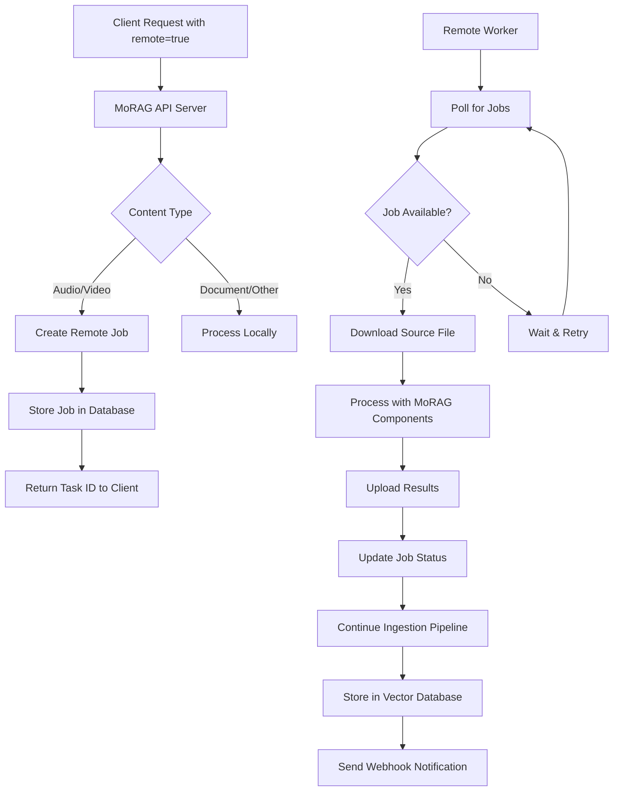

# Remote Conversion System - Overview Documentation

## Problem Statement

Current CPU workers on MoRAG servers lack sufficient processing power for efficient audio/video conversion tasks. This creates bottlenecks in the ingestion pipeline, particularly for media-heavy workloads that require transcription, speaker diarization, and video processing.

## Solution Architecture

Implement a remote conversion system that allows offloading conversion tasks to external workers while maintaining the existing ingestion workflow. This system uses a polling-based architecture where remote workers request jobs from the main server, process them locally, and return results.

## System Flow Diagram



## API Endpoint Specifications

### Remote Job Management Endpoints

#### 1. Create Remote Conversion Job
- **Endpoint**: `POST /api/v1/remote-jobs`
- **Purpose**: Create a new remote conversion job
- **Request Body**:
  ```json
  {
    "source_file_path": "/tmp/audio.mp3",
    "content_type": "audio",
    "task_options": {
      "webhook_url": "https://example.com/webhook",
      "metadata": {"source": "upload"}
    },
    "ingestion_task_id": "celery-task-uuid"
  }
  ```
- **Response**:
  ```json
  {
    "job_id": "remote-job-uuid",
    "status": "pending",
    "created_at": "2025-01-15T10:30:00Z"
  }
  ```

#### 2. Poll for Available Jobs
- **Endpoint**: `GET /api/v1/remote-jobs/{job_id}/poll`
- **Purpose**: Allow remote workers to poll for available jobs
- **Query Parameters**:
  - `worker_id`: Unique identifier for the worker
  - `content_types`: Comma-separated list of supported content types
- **Response**:
  ```json
  {
    "job_id": "remote-job-uuid",
    "source_file_url": "https://api.morag.com/files/download/temp-uuid",
    "content_type": "audio",
    "task_options": {
      "webhook_url": "https://example.com/webhook",
      "metadata": {"source": "upload"}
    }
  }
  ```

#### 3. Submit Conversion Results
- **Endpoint**: `PUT /api/v1/remote-jobs/{job_id}/result`
- **Purpose**: Submit processing results from remote worker
- **Request Body**:
  ```json
  {
    "success": true,
    "content": "Processed transcript content...",
    "metadata": {
      "processing_time": 45.2,
      "speakers": ["Speaker_00", "Speaker_01"],
      "topics": [...]
    },
    "error_message": null
  }
  ```
- **Response**:
  ```json
  {
    "status": "completed",
    "ingestion_continued": true
  }
  ```

#### 4. Check Job Status
- **Endpoint**: `GET /api/v1/remote-jobs/{job_id}/status`
- **Purpose**: Check the current status of a remote job
- **Response**:
  ```json
  {
    "job_id": "remote-job-uuid",
    "status": "processing",
    "worker_id": "worker-123",
    "created_at": "2025-01-15T10:30:00Z",
    "started_at": "2025-01-15T10:31:00Z",
    "estimated_completion": "2025-01-15T10:35:00Z"
  }
  ```

## File-Based Storage Schema

### Remote Jobs Storage Structure

Since MoRAG doesn't have a database yet, remote jobs will be stored as JSON files on disk with the following structure:

```
/app/data/remote_jobs/
├── pending/
│   ├── job-uuid-1.json
│   └── job-uuid-2.json
├── processing/
│   ├── job-uuid-3.json
│   └── job-uuid-4.json
├── completed/
│   └── job-uuid-5.json
├── failed/
│   └── job-uuid-6.json
├── timeout/
└── cancelled/
```

### Job File Format

Each job is stored as a JSON file with the following structure:

```json
{
  "id": "job-uuid-123",
  "ingestion_task_id": "celery-task-456",
  "source_file_path": "/tmp/audio.mp3",
  "content_type": "audio",
  "task_options": {
    "webhook_url": "https://example.com/webhook",
    "metadata": {"source": "upload"}
  },
  "status": "pending",
  "worker_id": null,
  "created_at": "2025-01-15T10:30:00Z",
  "started_at": null,
  "completed_at": null,
  "error_message": null,
  "result_data": null,
  "retry_count": 0,
  "max_retries": 3,
  "timeout_at": "2025-01-15T11:30:00Z"
}
```

### Job Status Lifecycle

1. **pending**: Job created, waiting for worker (stored in `pending/` directory)
2. **processing**: Worker has claimed the job and is processing (moved to `processing/` directory)
3. **completed**: Processing finished successfully (moved to `completed/` directory)
4. **failed**: Processing failed (after retries) (moved to `failed/` directory)
5. **timeout**: Job exceeded maximum processing time (moved to `timeout/` directory)
6. **cancelled**: Job was manually cancelled (moved to `cancelled/` directory)

### Repository Pattern Implementation

The file-based storage will use the repository pattern for easy migration to database later:

```python
class RemoteJobRepository:
    def create_job(self, job: RemoteJob) -> str
    def get_job(self, job_id: str) -> Optional[RemoteJob]
    def update_job(self, job: RemoteJob) -> bool
    def delete_job(self, job_id: str) -> bool
    def find_jobs_by_status(self, status: str) -> List[RemoteJob]
    def find_jobs_by_content_type(self, content_type: str) -> List[RemoteJob]
    def cleanup_old_jobs(self, days_old: int) -> int
```

## Error Handling and Failure Recovery

### Timeout Handling
- Jobs have configurable timeout periods (default: 30 minutes for audio, 60 minutes for video)
- Timed-out jobs are marked as failed and can be retried
- Workers must send periodic heartbeats during processing

### Retry Mechanisms
- Failed jobs are automatically retried up to 3 times
- Exponential backoff between retry attempts
- Different retry strategies for different error types

### Fallback to Local Processing
- If no remote workers are available after timeout, fall back to local processing
- Configurable fallback timeout (default: 5 minutes)
- Graceful degradation maintains system availability

### Worker Health Monitoring
- Workers register with heartbeat system
- Unhealthy workers are excluded from job assignment
- Jobs assigned to unhealthy workers are reassigned

## Integration Points with Existing MoRAG Components

### 1. Ingestion Tasks Integration
- Modify `ingest_file_task`, `ingest_url_task` to check for `remote=true` parameter
- Create remote job instead of local processing when remote flag is set
- Continue with vector storage after remote processing completes

### 2. File Transfer Integration
- Secure file download endpoints for remote workers
- Temporary file cleanup after remote processing
- Support for large file transfers with resumable uploads

### 3. Celery Task Integration
- Remote jobs integrate with existing Celery task tracking
- Webhook notifications work seamlessly with remote processing
- Task status endpoints include remote job information

### 4. MoRAG Component Reuse
- Remote workers use existing morag_audio, morag_video, etc. packages
- Same processing logic and configuration options
- Consistent output format and quality

## Security Considerations

### Authentication and Authorization
- Remote workers authenticate using API keys
- Job-specific download tokens with expiration
- Rate limiting on polling endpoints

### File Transfer Security
- Encrypted file transfers (HTTPS)
- Temporary download URLs with short expiration
- File integrity verification (checksums)

### Data Privacy
- Optional file encryption for sensitive content
- Secure deletion of temporary files
- Audit logging for all remote operations

## Configuration Options

### Environment Variables

```bash
# Remote conversion settings
MORAG_REMOTE_CONVERSION_ENABLED=true
MORAG_REMOTE_JOB_TIMEOUT_AUDIO=1800  # 30 minutes
MORAG_REMOTE_JOB_TIMEOUT_VIDEO=3600  # 60 minutes
MORAG_REMOTE_FALLBACK_TIMEOUT=300    # 5 minutes
MORAG_REMOTE_MAX_RETRIES=3
MORAG_REMOTE_WORKER_HEARTBEAT_INTERVAL=30

# File-based storage settings
MORAG_REMOTE_JOBS_DATA_DIR=/app/data/remote_jobs  # Directory for job storage
MORAG_REMOTE_FILE_DOWNLOAD_TIMEOUT=600  # 10 minutes
MORAG_REMOTE_MAX_FILE_SIZE=1073741824   # 1GB
MORAG_REMOTE_CLEANUP_DELAY=3600         # 1 hour
```

### Worker Configuration

```bash
# Remote worker settings
MORAG_WORKER_ID=gpu-worker-01
MORAG_WORKER_CONTENT_TYPES=audio,video
MORAG_WORKER_POLL_INTERVAL=10
MORAG_WORKER_MAX_CONCURRENT_JOBS=2
MORAG_API_BASE_URL=https://api.morag.com
MORAG_API_KEY=your-api-key-here
```

## Performance Considerations

### Scalability
- Multiple remote workers can process jobs concurrently
- Load balancing across available workers
- Queue prioritization for urgent jobs

### Monitoring
- Job processing time metrics
- Worker performance tracking
- Queue depth monitoring
- Error rate analysis

### Optimization
- Intelligent job assignment based on worker capabilities
- Batch processing for multiple small files
- Caching of frequently used models on workers

## Success Criteria

1. **Functional Requirements**:
   - Remote conversion jobs can be created via API parameter `remote=true`
   - Remote workers successfully poll, process, and return results
   - Failed remote jobs properly propagate errors to ingestion tasks
   - System gracefully falls back to local processing when needed

2. **Performance Requirements**:
   - Remote processing reduces server CPU usage by 80%+
   - End-to-end processing time comparable to local processing
   - System handles 10+ concurrent remote jobs without degradation

3. **Reliability Requirements**:
   - 99%+ job completion rate (including retries)
   - Automatic recovery from worker failures
   - No data loss during remote processing

4. **Compatibility Requirements**:
   - All existing functionality remains unchanged when `remote=false`
   - Existing API clients work without modification
   - Same output quality and format as local processing

## Implementation Timeline

1. **Phase 1**: API Extensions and File-Based Storage (Week 1)
2. **Phase 2**: Worker Modifications and Job Creation (Week 2)
3. **Phase 3**: Remote Converter Tool Development (Week 3)
4. **Phase 4**: Job Lifecycle Management and Error Handling (Week 4)
5. **Phase 5**: Testing, Documentation, and Deployment (Week 5)

## Migration Path to Database

When MoRAG adds database support in the future, the migration will be straightforward:

### Repository Pattern Benefits
- **Clean Interface**: The repository pattern provides a clean abstraction that can be easily swapped
- **Data Migration**: JSON files can be imported into database tables with simple scripts
- **Index Migration**: File-based indexes can be replaced with database indexes
- **Configuration Change**: Simple environment variable change to switch storage backends

### Migration Steps
1. **Implement Database Repository**: Create `DatabaseRemoteJobRepository` implementing the same interface
2. **Data Migration Script**: Convert JSON files to database records
3. **Configuration Update**: Change `MORAG_STORAGE_TYPE=database`
4. **Gradual Rollout**: Support both storage types during transition
5. **Cleanup**: Remove file-based storage after successful migration

### Compatibility
- **API Unchanged**: All API endpoints remain exactly the same
- **Service Layer Unchanged**: Business logic remains identical
- **Zero Downtime**: Migration can be performed without service interruption

## Next Steps

1. Review and approve this architecture document
2. Begin implementation with [Task 1: API Extensions](./01-api-extensions.md)
3. Set up development environment for testing remote workers
4. Create test scenarios for various failure modes
5. Plan deployment strategy for production rollout
